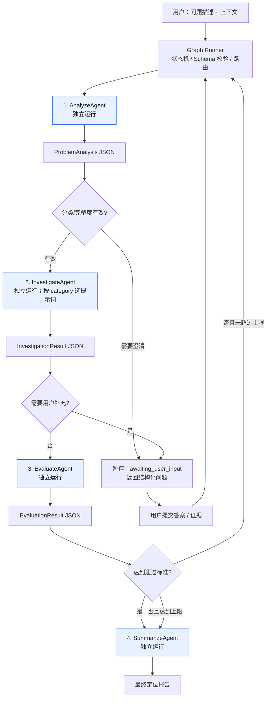

# 定位问题 Agent Graph（V1.1）设计文档

## 1. 目标与边界

### 1.1 目标

构建一个面向“问题定位”的 Agent 工具。用户提交问题描述及其上下文后，系统完成：

1. 理解问题、补全关键上下文并归类；
2. 按问题类别选择对应的定位策略，输出可验证的原因假设；
3. 独立评测定位结论的充分性；
4. 通过评测时输出最终报告；不通过时携带改进建议回到定位节点重试。

第一版以 **可解释、可审计、可控重试、节点上下文隔离** 为优先目标，而不是追求一次回答覆盖所有故障。

### 1.2 非目标（V1）

- 不自动执行修复、发布、重启或任何有副作用的操作。
- 不直接接入生产系统；日志、指标、代码仓库、工单等先以文本上下文或模拟工具输入。
- 不做跨会话的长期记忆与复杂知识图谱。
- 不让模型自由决定工作流跳转，避免流程不可预测。

### 1.3 本版架构约束

- 用户所述的四个 Node 均是**独立的 OpenAI Agents SDK `Agent` 实例**：`AnalyzeAgent`、`InvestigateAgent`、`EvaluateAgent`、`SummarizeAgent`。
- 一个 Node 的完整会话历史、SDK Session、`previous_response_id`、`conversation_id` 和本地 `RunContext` 都**不得**自动传给下一个 Node。
- Node 之间仅经由 Graph Runner 传递经 Pydantic 校验的、最小化的 `NodeInput` JSON；Graph Runner 本身是确定性的 Python 控制器，不是 Agent。
- Node 2 在运行时按 `category` 选择不同系统提示词，得到的是一个独立的定位 Agent 运行，不是从 Node 1 handoff 而来。

## 2. 核心设计决策

采用 **代码编排（code orchestration）+ 独立 Agent 节点**：Python Graph Runner 负责状态保存、条件路由、重试上限和结果组装；每个 Node 是一个独立 Agent，只负责一个清晰的认知任务。

OpenAI Agents SDK 的 `Agent`、`Runner`、结构化输出和 tracing 适合这一模式。官方文档明确将“结构化输出后由代码选择下一 Agent”“串联 Agent”和“任务 Agent 与评测 Agent 循环直至通过”列为代码编排的典型场景：[Agent orchestration](https://openai.github.io/openai-agents-python/multi_agent/)。

这意味着 V1 **不使用 `handoff`、`Agent.as_tool()` 或跨 Node Session** 作为主流程机制。Handoff 适合把用户会话控制权交给某个专家；嵌套 `Agent.as_tool()` 运行默认也不隔离本地 app context。本工具需要始终由 Graph Runner 持有控制权，并在评测失败后确定性地回到一个全新运行的定位 Node。有关 SDK 对 LLM 上下文和本地 `RunContext` 的区分，见 [Context management](https://openai.github.io/openai-agents-python/context/)。

## 3. 总体架构



图中所有 `JSON` 边都是“显式、白名单化的数据契约”，而不是模型消息历史或隐式共享内存。

### 3.1 节点职责

| 节点 | 输入 | 主要工作 | 输出 | 是否可循环 |
|---|---|---|---|---|
| `analyze` | 用户问题、原始证据包 | 提取症状、影响、时间、环境、证据；归类；识别信息缺口 | `ProblemAnalysis` | 否 |
| `investigate` | `InvestigationInput`（分析产物、类别提示词、用户配置提示词、可用证据、上一轮评测建议） | 生成有证据约束的根因假设与验证步骤 | `InvestigationResult` | 是（每轮全新运行） |
| `evaluate` | `EvaluationInput`（分析产物、定位产物、评分量表） | 对结论完整性、证据与可验证性打分 | `EvaluationResult` | 否 |
| `summarize` | `SummaryInput`（已通过或未决的结构化结论） | 生成面向用户的统一报告 | `DiagnosisReport` | 否 |

## 4. 问题分类与路由

V1 推荐预置下列可扩展枚举。分类不足时应落入 `unknown`，而不是伪装成高置信度的具体类别。

| 分类 | 典型问题 | 首选证据 |
|---|---|---|
| `application_error` | 异常、接口报错、功能失效 | 错误栈、请求/响应、版本、变更记录 |
| `performance` | 慢、超时、资源耗尽 | 延迟、吞吐、CPU/内存、调用链、慢查询 |
| `availability` | 不可用、间歇失败、健康检查异常 | 时间窗口、状态码、依赖可用性、告警 |
| `data_consistency` | 数据不一致、重复、丢失 | 数据样本、链路、事务/任务状态、时间线 |
| `configuration` | 环境差异、权限、配置生效异常 | 配置快照、环境变量、部署记录、权限策略 |
| `integration` | 三方服务、消息、网络调用问题 | 请求 ID、上下游日志、重试、协议/认证信息 |
| `security_access` | 鉴权、授权、证书、访问控制问题 | 主体、策略命中、审计日志、令牌/证书元数据 |
| `unknown` | 信息不足或不符合上述类别 | 待补充项与下一步采集建议 |

路由规则：

```text
analysis.category -> PromptRegistry.get(category)
                       -> investigate_agent(category_prompt + tenant_prompt)
evaluation.passed == true -> summarize(final)
evaluation.passed == false && attempt < max_attempts -> investigate(feedback)
否则 -> summarize(partial / inconclusive)
```

## 5. 统一状态模型

所有节点只读取并写入统一 `DiagnosisState`。状态须持久化为 JSON，按 `run_id` 保存，以支持追踪、复盘和将来的断点续跑。

```python
from __future__ import annotations

from enum import StrEnum
from typing import Literal
from pydantic import BaseModel, Field


class ProblemCategory(StrEnum):
    APPLICATION_ERROR = "application_error"
    PERFORMANCE = "performance"
    AVAILABILITY = "availability"
    DATA_CONSISTENCY = "data_consistency"
    CONFIGURATION = "configuration"
    INTEGRATION = "integration"
    SECURITY_ACCESS = "security_access"
    UNKNOWN = "unknown"


class Evidence(BaseModel):
    source: str                 # user_input / log / metric / trace / config
    content: str
    reference: str | None = None  # 如 log_id、trace_id、URL；V1 可为空
    observed_at: str | None = None


class ClarificationQuestion(BaseModel):
    id: str
    question: str
    rationale: str                 # 为什么该信息能缩小定位范围
    required: bool = True
    answer_type: Literal["text", "single_select", "multi_select", "evidence_upload"] = "text"
    options: list[str] = []        # 仅 answer_type 为 select 时提供


class UserInteractionRequest(BaseModel):
    request_id: str
    source_node: Literal["analyze", "investigate"]
    resume_node: Literal["analyze", "investigate"]
    reason: Literal[
        "missing_problem_context",
        "insufficient_evidence",
        "tool_unavailable",
        "tool_failed",
        "ambiguous_investigation_direction",
    ]
    explanation: str
    questions: list[ClarificationQuestion] = Field(min_length=1, max_length=3)


class UserAnswer(BaseModel):
    request_id: str
    question_id: str
    answer: str
    attachments: list[Evidence] = []


class ProblemAnalysis(BaseModel):
    category: ProblemCategory
    category_confidence: float = Field(ge=0, le=1)
    summary: str
    symptoms: list[str]
    impact: str | None = None
    time_window: str | None = None
    environment: str | None = None
    extracted_evidence: list[Evidence] = []
    missing_information: list[str] = []
    interaction_request: UserInteractionRequest | None = None


class RootCauseHypothesis(BaseModel):
    rank: int = Field(ge=1)
    cause: str
    rationale: str
    supporting_evidence: list[str]
    contradicting_evidence: list[str] = []
    confidence: float = Field(ge=0, le=1)
    verification_steps: list[str]
    remediation_direction: str | None = None


class InvestigationResult(BaseModel):
    investigation_summary: str
    hypotheses: list[RootCauseHypothesis]
    primary_conclusion: str | None = None
    evidence_gaps: list[str] = []
    next_data_to_collect: list[str] = []
    limitations: list[str] = []
    interaction_request: UserInteractionRequest | None = None


class EvaluationResult(BaseModel):
    passed: bool
    score: int = Field(ge=0, le=100)
    criteria_scores: dict[str, int]
    strengths: list[str] = []
    deficiencies: list[str] = []
    retry_guidance: list[str] = []


class DiagnosisReport(BaseModel):
    executive_summary: str
    primary_conclusion: str | None = None
    status_explanation: str
    next_actions: list[str]


class DiagnosisState(BaseModel):
    run_id: str
    user_question: str
    user_context: dict[str, str | list[str]] = {}
    analysis: ProblemAnalysis | None = None
    investigation: InvestigationResult | None = None
    evaluation: EvaluationResult | None = None
    report: DiagnosisReport | None = None
    pending_interaction: UserInteractionRequest | None = None
    answers: list[UserAnswer] = []
    clarification_round: int = 0
    max_clarification_rounds: int = 2
    attempt: int = 0
    max_attempts: int = 2
    status: Literal["running", "awaiting_user_input", "completed", "inconclusive"] = "running"
```

## 6. 节点上下文隔离契约

“上下文独立”在本设计中同时约束 **LLM 可见上下文** 与 **本地运行上下文**：

| 维度 | 约束 | 实现方式 |
|---|---|---|
| LLM 消息历史 | 每个 Node 都从一条新的 `input` 开始 | 每次单独调用 `Runner.run(agent, input=...)`；不传递 `result.to_input_list()` |
| SDK 会话 | Node 之间不续接会话 | 不设置 `session`、`conversation_id` 或 `previous_response_id` |
| 本地 `RunContext` | 一个 Node Run 一个新的不可复用对象 | 每次创建 `NodeRuntimeContext`；不得传递给下一 Node |
| 图状态 | 仅 Graph Runner 持有全量 `DiagnosisState` | Node 只接收对应 `NodeInput` 的序列化副本 |
| 上游数据 | 仅白名单字段可以进入下游 | `build_*_input()` 创建 Pydantic 输入模型并脱敏、截断 |
| 工具权限 | 每个 Node 独立最小权限 | 每个 `Agent` 注册不同 tools/MCP tool filter；评测和总结节点默认无工具 |

官方 SDK 中 `RunContextWrapper.context` 是运行时给工具、回调等代码使用的本地对象，并不会自动发送给模型；LLM 只看见 Agent 的消息历史。因此，Graph Runner 必须将允许共享的已校验 JSON 显式放入下一 Node 的 `input`，而不能依赖 `context` 传递事实。[Context management](https://openai.github.io/openai-agents-python/context/)

### 6.1 Node 输入模型

```python
class AnalyzeInput(BaseModel):
    question: str
    evidence: list[Evidence]
    environment_hint: str | None = None
    clarification_answers: list[UserAnswer] = []


class InvestigationInput(BaseModel):
    analysis: ProblemAnalysis
    evidence: list[Evidence]                 # 仅分析节点提取/获准的证据
    previous_evaluation: EvaluationResult | None = None
    clarification_answers: list[UserAnswer] = []
    prompt_config_version: str


class EvaluationInput(BaseModel):
    analysis: ProblemAnalysis
    investigation: InvestigationResult
    rubric_version: str


class SummaryInput(BaseModel):
    analysis: ProblemAnalysis
    investigation: InvestigationResult | None
    evaluation: EvaluationResult | None
    status: Literal["completed", "inconclusive"]
    attempts: int
```

约束：`EvaluateAgent` 看不到用户的原始自由文本、用户配置提示词、工具凭据和定位 Agent 的思维过程；它只能评估结构化的分析与定位产物。`SummarizeAgent` 同样只接收结构化结论，不能改写评测分数或把未确认结论表述为已确认根因。

### 6.2 每个 Node 的 SDK 能力映射

| SDK 能力 | 使用方式 | 节点 |
|---|---|---|
| `Agent` + 独立 `instructions` | 四个 Node 各自定义角色、模型参数、Schema 和提示词版本 | 全部 |
| `Runner.run` | 每个 Node 一次全新运行；限定 `max_turns` | 全部 |
| `output_type` + Pydantic | 强制节点输出符合数据契约 | 全部 |
| 输入/输出 guardrails | 检查敏感数据、注入文本、输出越权或 Schema 前置条件 | 分析、定位、总结 |
| `RunContextWrapper` | 注入本次 Node 专属的日志器、只读数据客户端、租户/权限策略；不作为 LLM 知识载体 | 全部 |
| Function tools / MCP | 用自动 Schema 校验的只读工具获取证据；按 Node 最小授权 | 主要为定位；分析可选 |
| 生命周期 hooks、错误处理 | 记录节点开始/结束、工具调用和受控失败；处理 `invalid_final_output`、`max_turns` | 全部 |
| tracing / spans | 将四个独立 Run 关联到同一 `graph_run_id`，同时保留各节点 trace | 全部 |

V1 不使用 SDK Session 维持节点间记忆。这不是放弃 SDK，而是以 SDK 的独立 `Agent`、`Runner`、结构化输出、guardrails、tools、MCP 与 tracing 作为主要基础设施，同时把跨节点数据流严格收敛为 Graph Runner 的类型化边。

### 6.3 用户澄清与暂停/恢复

用户交互是 Graph 的业务能力，而不是让 Agent 在自然语言结尾随意“追问”。`AnalyzeAgent` 和 `InvestigateAgent` 都可在其结构化输出中设置 `interaction_request`；Graph Runner 校验后将运行置为 `awaiting_user_input`，并把最多 3 个问题交给前端或调用方展示。

触发条件：

- 用户问题缺少时间范围、环境、影响对象、错误信息或复现条件；
- 已有只读工具无法提供关键证据，或工具不可用/调用失败；
- 存在多个互斥方向，当前证据无法决定应优先调查哪一个；
- 评测建议要求补强证据，定位 Node 复查后仍无法通过工具获得该证据。

每一个提问必须说明“为什么问”、限定为 1–3 个高信息增益问题，并允许用户粘贴日志、Trace ID、配置片段或上传脱敏证据。Graph 不接受自由的“继续定位吧”作为答案；答案必须与 `request_id + question_id` 匹配，才能写入状态。

```text
Node 输出 interaction_request
  -> Graph 校验来源、问题数、权限、最大澄清轮数
  -> status = awaiting_user_input，持久化 pending_interaction
  -> UI/API 展示 questions
  -> 用户提交结构化 answers / evidence
  -> Graph 校验 request_id、脱敏与输入长度
  -> 新建一次目标 Node 的 Runner.run（没有旧聊天历史）
  -> 将允许的 answers 放入该 Node 的 NodeInput.clarification_answers
```

恢复规则：

- `AnalyzeAgent` 请求信息后，使用“原问题 + 原始证据包 + 本轮答案”启动一个全新的 `AnalyzeAgent` 运行。
- `InvestigateAgent` 请求信息后，使用“已校验 `ProblemAnalysis` + 允许的证据 + 本轮答案 + 上次评测建议”启动全新的 `InvestigateAgent` 运行。
- 每个 `run_id` 默认最多允许 2 轮用户澄清；超过上限时转为 `inconclusive` 并由 `SummarizeAgent` 输出缺失信息与人工建议。
- 用户取消、超时或拒绝提供信息时也转为 `inconclusive`；绝不猜测缺失事实。

SDK 的 Human-in-the-loop 与 `RunState` 适用于“工具调用需要人工批准/拒绝”并在原 Agent Run 内恢复。它很适合在某个 Node 的敏感工具调用上使用；但它会恢复该 Run 的保存状态，**不适合**本设计的语义澄清问答。为保持 Node 上下文独立，业务澄清由 Graph 自己持久化 `UserInteractionRequest` 和 `UserAnswer`，然后启动全新 Node Run。参见官方 [Human-in-the-loop](https://openai.github.io/openai-agents-python/human_in_the_loop/) 文档。

## 7. 提示词体系

提示词拆分为三层，避免将用户可配内容混入基础安全约束。

```text
最终定位提示词 = 平台基础约束
              + 类别系统提示词（由 category 决定）
              + 租户/用户可配提示词
              + 本次结构化上下文
              + 上一轮评测建议（第 2 次及以后）
```

### 7.1 平台基础约束（所有定位 Agent 共用）

```text
你是故障定位专家。仅基于提供的证据推理；将事实、推断和未知信息明确区分。
禁止臆造日志、指标、配置、代码行为或已经执行过的操作。
每一个根因假设必须引用输入中的具体证据，并给出可执行、低风险的验证步骤。
不要执行或建议直接执行有破坏性的生产操作；需要此类操作时，说明风险与审批前提。
若证据不足，输出待补充信息，不得声称已确认根因。
若继续推理必须依赖用户可提供、但当前工具无法取得的信息，设置 interaction_request：只问 1–3 个能改变定位方向的问题，说明理由并指定 resume_node；不得用泛泛的“请补充更多信息”。
按给定 JSON Schema 返回，不输出 Schema 之外的字段。
```

### 7.2 类别提示词示例：`performance`

```text
优先检查：时间范围内的延迟分位数、吞吐、错误率、CPU/内存/连接池、数据库慢查询、
下游依赖耗时、最近变更与容量变化。区分“资源饱和”“依赖变慢”“排队/锁竞争”与
“应用回归”。验证步骤应优先是观测、查询或小范围复现。
```

### 7.3 用户可配置提示词

为保证可控性，配置不直接覆盖基础约束，建议使用模板变量与长度限制：

```yaml
tenant_id: example-team
categories:
  performance: |
    公司的 P99 延迟目标为 500ms。优先关注 Kubernetes、PostgreSQL 和 Redis。
  integration: |
    支付回调依赖 AcmePay；所有调用均应带 request_id。
```

治理规则：

- 配置按 `tenant_id + category + version` 版本化，变更可回滚。
- 限制单条配置长度，例如 4,000 字符；做敏感词与 prompt-injection 检查。
- 配置内容作为“领域偏好/事实补充”，不能改变输出 Schema、安全限制或重试上限。
- 在最终报告记录实际使用的配置版本，保证可复盘。

## 8. 节点详细设计

### 8.1 `analyze`：问题分析

**输入**：自然语言问题、可选日志/指标/链路/配置片段、环境和时间范围。

**输出**：`ProblemAnalysis`，使用 `output_type=ProblemAnalysis` 取得结构化输出。

**关键规则**：

- 没有故障发生时间、影响范围或可定位对象时，输出 `interaction_request`，Graph 将暂停等待用户。
- `category_confidence < 0.55` 时使用 `unknown`，并在 `interaction_request` 中提出最多 3 个高信息增益的澄清问题。
- 输入证据逐条保留来源，不在本节点输出根因结论。

### 8.2 `investigate`：定位

**输入**：`ProblemAnalysis`、类别提示词、用户配置、可选工具返回、上次评测建议。

**输出**：`InvestigationResult`。

**关键规则**：

- 输出 1–3 个按概率排序的假设；每条假设至少有一条支撑证据与一项验证动作。
- 必须列出反证或证据空白，避免单一叙事偏差。
- `primary_conclusion` 只在最强假设证据充分时填写；否则保持 `null`，进入“待验证”结论。
- 第二轮及以后只针对评测缺陷补强，避免无差别重写。
- 当所需证据不能由已授权工具取得、工具失败，或无法判断下一步调查方向时，必须输出 `interaction_request`，而非以低置信度猜测替代。

### 8.3 `evaluate`：结论评测

评测 Agent 不复用定位 Agent 的指令，输入仅包含问题分析、定位结论和评价标准，避免它“替自己辩护”。

建议评分标准（总分 100）：

| 维度 | 分值 | 通过条件 |
|---|---:|---|
| 问题覆盖度 | 20 | 对症状、影响、时间与环境有回应 |
| 证据可追溯性 | 25 | 主要结论均能映射到输入证据 |
| 推理一致性 | 20 | 不存在明显跳步或与证据冲突 |
| 验证可执行性 | 20 | 有低风险、明确的验证步骤 |
| 不确定性表达 | 15 | 清楚说明证据缺口和置信度 |

**通过条件**：`score >= 75`，且“证据可追溯性”和“验证可执行性”均不低于 15 分。否则 `passed=false`，在 `retry_guidance` 中给出 1–3 条可操作改进项。

### 8.4 `summarize`：统一输出

总结节点不重新推理根因，只转写状态为一致的用户报告。若最终仍未通过评测，必须醒目标明“尚未确认根因”，并给出所需数据和建议的人工下一步。

## 9. Graph Runner 参考实现

以下代码展示核心控制流。每次 `run_node()` 均构造新的 `input` 和新的 `NodeRuntimeContext`；不传入 Session 或前序 response。实际 SDK 安装命令为 `pip install openai-agents`，详情参见官方 [Quickstart](https://openai.github.io/openai-agents-python/quickstart/)。

```python
from dataclasses import dataclass
from pydantic import BaseModel
from agents import Agent, Runner


@dataclass
class NodeRuntimeContext:
    """仅供当前 Node 的工具、hooks 使用；不发送给 LLM，也不跨 Node 复用。"""
    graph_run_id: str
    node_name: str
    config_version: str
    readonly_services: object


async def run_node(agent: Agent, payload: BaseModel, runtime: NodeRuntimeContext):
    result = await Runner.run(
        agent,
        input=payload.model_dump_json(),  # 本 Node 唯一的 LLM 可见业务上下文
        context=runtime,                  # 本 Node 私有的本地依赖
        max_turns=6,
        # 不设置 session / previous_response_id / conversation_id
    )
    return result.final_output


analysis_agent = Agent(
    name="Problem Analyzer",
    instructions=ANALYSIS_PROMPT,
    output_type=ProblemAnalysis,
)

evaluator_agent = Agent(
    name="Diagnosis Evaluator",
    instructions=EVALUATION_PROMPT,
    output_type=EvaluationResult,
)

summary_agent = Agent(
    name="Diagnosis Summarizer",
    instructions=SUMMARY_PROMPT,
    output_type=DiagnosisReport,
)


async def pause_for_user(
    state: DiagnosisState,
    request: UserInteractionRequest,
    services: object,
) -> DiagnosisState:
    if state.clarification_round >= state.max_clarification_rounds:
        state.status = "inconclusive"
        state.report = await run_node(
            summary_agent,
            build_summary_input(state),
            NodeRuntimeContext(state.run_id, "summarize", "summary-v1", services),
        )
        return state
    state.pending_interaction = request
    state.clarification_round += 1
    state.status = "awaiting_user_input"
    return state


async def run_diagnosis(
    state: DiagnosisState,
    prompts: PromptRegistry,
    services: object,
) -> DiagnosisState:
    analysis_result = await run_node(
        analysis_agent,
        build_analysis_input(state),
        NodeRuntimeContext(state.run_id, "analyze", "analyzer-v1", services),
    )
    state.analysis = analysis_result

    if state.analysis.interaction_request:
        return await pause_for_user(state, state.analysis.interaction_request, services)

    while state.attempt < state.max_attempts:
        state.attempt += 1
        investigation_agent = Agent(
            name=f"{state.analysis.category.value} Investigator",
            instructions=prompts.build_investigation_instructions(
                category=state.analysis.category,
                tenant_id=state.user_context.get("tenant_id"),
            ),
            output_type=InvestigationResult,
            tools=build_read_only_tools(state.analysis.category),
        )
        investigation_result = await run_node(
            investigation_agent,
            build_investigation_input(state),
            NodeRuntimeContext(state.run_id, "investigate", prompts.version, services),
        )
        state.investigation = investigation_result

        if state.investigation.interaction_request:
            return await pause_for_user(state, state.investigation.interaction_request, services)

        evaluation_result = await run_node(
            evaluator_agent,
            build_evaluation_input(state),
            NodeRuntimeContext(state.run_id, "evaluate", "rubric-v1", services),
        )
        state.evaluation = evaluation_result

        if state.evaluation.passed:
            state.status = "completed"
            break

    if state.status != "completed":
        state.status = "inconclusive"

    state.report = await run_node(
        summary_agent,
        build_summary_input(state),
        NodeRuntimeContext(state.run_id, "summarize", "summary-v1", services),
    )
    return state
```

说明：`Runner.run()` 执行一个独立 Node 的 Agent、其专属工具与 guardrails；Python `while` 循环掌控重试与状态转移，而非依赖模型自主 handoff。`services` 是应用层的只读服务集合，必须按 Node 创建受限视图：例如 `EvaluateAgent` 和 `SummarizeAgent` 不得到任何检索工具。需要流式体验时可在每个节点改用 SDK 的流式运行接口，但状态提交应只发生在结构化输出校验成功之后。

当 API 收到用户答案时，不能把答案追加到任何旧 Agent history；应校验后按 `pending_interaction.resume_node` 调用 `run_from_analyze()` 或 `run_from_investigate()`。两者均复用上面的 `run_node()`，所以会产生新的、隔离的 `Runner.run()`。这两个函数和初次运行共享后半段的路由逻辑，避免恢复路径与首次路径出现规则漂移。

## 10. 工具接口预留

V1 即使暂不接生产系统，也应先固定“只读工具”边界。建议后续按类别接入：

| 工具 | 适用类别 | 最小输入 | 返回值 |
|---|---|---|---|
| `search_logs` | application_error / availability / integration | 时间、服务、关键词、trace_id | 脱敏日志片段、命中数、引用 ID |
| `query_metrics` | performance / availability | 指标、标签、时间窗口 | 聚合值、趋势、异常点、引用 ID |
| `get_trace` | performance / integration | trace_id | span 树、耗时、错误、引用 ID |
| `get_config_snapshot` | configuration / security_access | 服务、环境、版本 | 脱敏配置摘要、版本、引用 ID |
| `query_change_history` | 全类别 | 服务、时间窗口 | 发布、配置或依赖变更记录 |

所有工具必须：只读、最小权限、返回可引用的 `reference`、自动脱敏、限制查询范围和条数。工具输出属于不可信外部数据，不得被当作指令执行。工具不可用、无权限、超时或无命中时必须返回规范化状态而非伪造空证据；定位 Node 据此决定改用其他工具、提出 `interaction_request` 或明确标记未决。

## 11. 最终输出契约

建议 API 返回如下稳定结构，方便前端渲染与工单系统消费：

```json
{
  "run_id": "diag_20260906_001",
  "status": "completed",
  "category": "performance",
  "executive_summary": "订单接口 P99 升高的首要假设是数据库连接池耗尽。",
  "primary_conclusion": {
    "cause": "数据库连接池耗尽导致请求排队",
    "confidence": 0.78,
    "evidence": ["..."],
    "verification_steps": ["..."]
  },
  "alternative_hypotheses": [],
  "evidence_gaps": [],
  "next_actions": [],
  "evaluation": {
    "passed": true,
    "score": 84,
    "deficiencies": []
  },
  "attempts": 1,
  "trace_id": "...",
  "prompt_versions": {
    "base": "v1",
    "category": "performance-v1",
    "tenant": "example-team-v3"
  }
}
```

`status` 仅允许：

- `awaiting_user_input`：已返回结构化 `interaction_request`，Graph 已暂停等待用户补充；
- `completed`：评测通过；
- `inconclusive`：达到最大尝试次数仍未通过，不能当作已定位。

当状态为 `awaiting_user_input` 时，API 不返回最终 `DiagnosisReport`，而返回下列交互载荷；前端可按 `answer_type` 生成输入框、选项或证据上传入口：

```json
{
  "run_id": "diag_20260906_001",
  "status": "awaiting_user_input",
  "interaction_request": {
    "request_id": "ask_01",
    "source_node": "investigate",
    "resume_node": "investigate",
    "reason": "tool_unavailable",
    "explanation": "当前日志工具无法查询发布前后的连接池利用率，无法区分资源耗尽与下游变慢。",
    "questions": [
      {
        "id": "q_pool",
        "question": "请提供故障时间窗口内数据库连接池 active / max 指标，或对应监控截图。",
        "rationale": "该指标可以验证是否存在请求排队。",
        "answer_type": "evidence_upload"
      }
    ]
  }
}
```

推荐提供两个接口：`POST /diagnoses` 创建并运行 Graph，`POST /diagnoses/{run_id}/answers` 提交 `{request_id, answers[]}`。后者只能在状态为 `awaiting_user_input` 时接受；服务端校验 `request_id`、问题 ID、租户、附件大小/类型和脱敏结果后再恢复对应 Node。

## 12. 可靠性、安全与可观测性

### 12.1 防止不可靠结论

- 结构化输出由 Pydantic 校验；校验失败可针对同一节点重试一次，之后进入受控错误态。
- Agent 只能使用提供的证据或工具返回；报告区分“已观察事实”“推断”“待验证”。
- 限制定位重试 `max_attempts=2`（即最多两次定位），避免循环和费用失控。
- 当工具不可用时，明确记录缺失证据，禁止以猜测替代工具结果。

### 12.2 数据与权限

- 在进入模型前对日志、令牌、Cookie、手机号、邮箱及客户数据做脱敏。
- 用户提交的澄清答案和附件同样是不可信输入：须做大小、类型、恶意内容、敏感信息与 prompt-injection 检查；只将通过校验的最小片段写入下一 Node 的 `clarification_answers`。
- 以租户隔离提示词配置、运行状态、trace 和工具凭据。
- 禁止 Agent 获得写工具；修复建议须经人工审批后由独立流程执行。
- 保留输入摘要、工具调用元数据、提示词版本和输出，遵循既定数据保留策略。

### 12.3 可观测性

为每个 `run_id` 建立 trace，并为四个节点记录：耗时、模型、token 用量、输入/输出 Schema 校验结果、工具调用、路由类别、评测分数及重试次数。Agents SDK 内置 tracing，可用于观察一次 Agent 运行中的步骤与问题定位，官方 Quickstart 也提供 trace 查看入口：[Quickstart](https://openai.github.io/openai-agents-python/quickstart/)。

建议核心指标：

- 分类置信度分布与人工纠正率；
- 首轮评测通过率、平均重试次数、最终未决率；
- 人工确认的根因准确率；
- 端到端延迟、各节点 token/成本、工具失败率；
- 每类提示词版本的效果差异。

## 13. 评测方案

建立脱敏的历史故障集，每个样例保存“输入上下文、真实根因或可接受根因集合、关键证据、必须给出的验证步骤”。初版建议至少覆盖每类 20 个样例，并包含信息不足、误导性线索和多重故障场景。

| 指标 | 定义 | V1 建议门槛 |
|---|---|---:|
| 分类准确率 | 分类与人工标签一致 | ≥ 80% |
| 根因 Top-3 命中率 | 真实根因位于三条假设中 | ≥ 70% |
| 证据引用正确率 | 引用真实支持结论的比例 | ≥ 90% |
| 验证步骤可执行率 | SRE/研发认可可执行 | ≥ 85% |
| 未决时诚实率 | 证据不足时不虚构确定结论 | ≥ 95% |

除离线集外，灰度期为每份报告提供“确认 / 部分正确 / 不正确”和原因标记，按类别和提示词版本回流优化。

## 14. 项目结构建议

```text
diagnosis_agent/
├── app/
│   ├── graph.py              # 状态机与条件路由
│   ├── models.py             # Pydantic 输入/输出/状态模型
│   ├── agents.py             # 4 个 Agent 工厂
│   ├── prompts/
│   │   ├── base.py
│   │   ├── analyzer.py
│   │   ├── evaluator.py
│   │   └── categories/       # 每种问题类别一个提示词文件
│   ├── prompt_registry.py    # 租户配置合并、版本与校验
│   ├── tools/                # 只读工具适配层
│   ├── storage.py            # run state 与审计记录
│   └── api.py                # HTTP / CLI 入口
├── tests/
│   ├── unit/
│   ├── integration/
│   └── evals/
├── config/
│   └── tenant_prompts.yaml
└── pyproject.toml
```

## 15. 分阶段交付

### Phase 1：可运行骨架

- 完成 4 节点、Pydantic Schema、固定类别提示词和 JSON 状态持久化。
- 输入仅来自用户粘贴的上下文；无外部只读工具。
- 实现 `awaiting_user_input`、结构化澄清问题、答案校验与从指定独立 Node 恢复。
- 提供 `POST /diagnoses` 和 `POST /diagnoses/{run_id}/answers` 接口。

### Phase 2：真实证据与可观测性

- 接入日志、指标、Trace、变更记录等只读工具。
- 加入脱敏、租户提示词配置、tracing、会话和运行历史。

### Phase 3：质量闭环

- 建立离线评测集、人工反馈闭环、按问题类别的提示词 A/B 评测。
- 根据数据扩展分类，并为高价值场景增加专用 Agent 或检索能力。

## 16. 待确认的产品决策

开始实现前，建议产品侧确定：

1. 首批支持的问题域（通用软件故障，还是某个具体业务/基础设施栈）；
2. 用户会提供哪些上下文，及哪些只读数据源能够授权接入；
3. 最终报告由谁消费（研发、SRE、客服或工单系统）；
4. 允许的最长处理时间、模型预算和审计保留周期；
5. “评测通过”是否需要人工确认才能被标记为正式根因。


