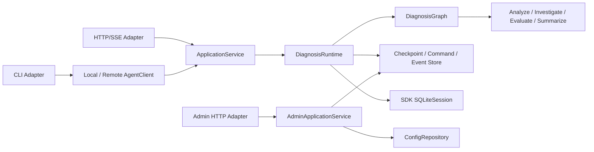

# BugLens 后端架构

本文只描述后端组件职责、依赖方向、Agent Graph 和 Agents SDK 使用边界。跨前后端的 HTTP/SSE 字段与端点见根目录 `frontend-backend-contract.md`；生命周期和持久化语义见 `runtime-protocol.md`；配置与管理控制面见 `configuration-and-operations.md`。

## 总体结构



依赖方向为 Adapter → Application Service → Runtime → Graph/Domain。Infra 实现 Runtime 需要的持久化、Session 和配置端口。`bootstrap.py` 是依赖组装入口。任何下层模块都不能反向导入 Adapter。

## 组件边界

| 组件 | 负责 | 不负责 |
| --- | --- | --- |
| Adapter | CLI 参数、HTTP DTO、SSE 编码、输出渲染 | Graph 路由、检查点、模型消息拼接 |
| AgentClient | 用统一 Command/Event 接口屏蔽本地与远程执行 | 业务状态判断 |
| Application Service | run 创建、身份上下文、profile 选择、服务入口和查询 | 节点路由、模型推理 |
| Runtime | 幂等、revision、加载检查点、推进 Graph、调用 NodeRunner、提交状态与 Event | 自主改变 Graph 流程 |
| Graph | 基于结构化状态做确定性节点转换、澄清和评测重试 | stdin、HTTP、数据库、SDK Session |
| NodeRunner | 把结构化输入交给指定 Agent，并返回严格输出 | 生命周期提交和跨节点路由 |
| Store | 原子保存业务状态、Command、Event、租约和配置快照 | 保存或解释模型对话 |
| SDK Session | 保存单节点模型消息历史 | 业务状态、恢复游标和前端会话 |
| Admin Service | 健康、能力、配置和只读运维查询 | 调用 Graph 或触发诊断节点 |

## Agent Graph

```text
analyze → investigate → evaluate ──通过/达到上限──→ summarize → done
              ↑            │
              └──可重试────┘
```

- `analyze`：提取症状、影响、时间和环境并分类，不输出根因。
- `investigate`：生成 1–3 条有证据支持、可验证的原因假设。
- `evaluate`：独立检查覆盖度、证据可追溯性、推理、验证步骤和不确定性。
- `summarize`：转写已评测的结构化结果，不重新推理或改变结论。

Analyze 或 Investigate 可以返回 `UserInteractionRequest`。Runtime 提交等待状态后结束本次短执行；答案通过新 Command 回到请求来源节点。Evaluate 未通过时，只能在代码规定的次数内回到原 Investigate Session。

## Agents SDK 边界

| SDK 能力 | 用途 |
| --- | --- |
| `Agent` | 定义四个职责独立的节点 |
| Pydantic `output_type` | 约束节点结构化输出 |
| `Runner.run()` | 执行模型调用和 SDK 内部循环 |
| `SQLiteSession` | 保存同一节点的多轮模型消息 |
| `RunContextWrapper` | 传递 run ID、节点名和配置版本等本地上下文 |
| `trace()` | 以 `run_id` 聚合一次诊断的节点运行 |
| `max_turns` | 限制单节点模型循环 |

每个 `{run_id}:{node_name}` 使用独立 Session。同一节点的澄清和评测重试复用 Session；不同节点不共享完整对话。项目不同时使用 Session、`previous_response_id`、Conversations API 或手工消息回放。

handoff 和 `Agent.as_tool()` 不用于主流程，因为节点顺序、评测门禁和重试上限必须由确定性 Graph 控制。SDK 的工具、guardrail、hooks、streaming 和 `RunState` 可在需要时接入，但必须先映射到项目协议和生命周期，不能直接暴露 SDK 对象给 Adapter。

## 源码布局

当前实现保持扁平、小型模块：

```text
backend/app/
├── models.py             # 领域状态和节点输入输出
├── protocol/             # Command/Event Schema
├── graph.py              # 确定性路由
├── agents.py             # Agent 与 NodeRunner
├── runtime.py            # 生命周期推进和提交
├── application.py        # 诊断应用服务
├── admin.py              # 管理应用服务
├── client.py             # 本地/远程客户端
├── infra.py              # SQLite Store
├── config.py             # profile 与快照解析
├── cli.py                # CLI Adapter
├── web.py                # ASGI Adapter
├── server.py             # Uvicorn 入口
└── bootstrap.py          # 依赖组装
```

只有在模块职责已经混杂时才继续拆包；不要为每个类单独建文件，也不要为了目录形式复制现有逻辑。

## 架构验收

- CLI 和 Web 不导入或构造 `DiagnosisGraph`。
- 相同 Command 序列产生等价状态和持久化 Event。
- Graph 测试不启动 transport；Adapter 测试使用 fake Service/Runner。
- SDK Session 不承担业务恢复，Store 不保存模型消息。
- 删除前端后，CLI、HTTP/SSE API 和 backend-only 部署仍可工作。
