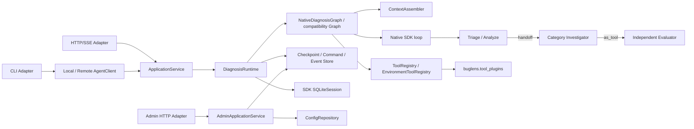

# BugLens 后端架构

本文只描述后端组件职责、依赖方向、Agent Graph 和 Agents SDK 使用边界。跨前后端的 HTTP/SSE 字段与端点见根目录 `frontend-backend-contract.md`；生命周期和持久化语义见 `runtime-protocol.md`；配置与管理控制面见 `configuration-and-operations.md`。

## 总体结构



依赖方向为 Adapter → Application Service → Runtime → Graph/Domain。Infra 实现 Runtime 需要的持久化、Session 和配置端口。`bootstrap.py` 是依赖组装入口。任何下层模块都不能反向导入 Adapter。

## 组件边界

| 组件 | 负责 | 不负责 |
| --- | --- | --- |
| Adapter | CLI 参数、HTTP DTO、SSE 编码、输出渲染 | Graph 路由、检查点、模型消息拼接 |
| AgentClient | 用统一 Command/Event 接口屏蔽本地与远程执行 | 业务状态判断 |
| Application Service | run 创建、身份上下文、profile 选择、服务入口和查询 | 节点路由、模型推理 |
| Runtime | 幂等、revision、加载检查点、推进一次应用层 turn、调用 NodeRunner、提交状态与 Event | 自主改变业务流程 |
| Graph | `NativeDiagnosisGraph` 只组装结构化 turn 输入并校验确定性状态转换；保留 `DiagnosisGraph` 兼容旧 profile/测试 | stdin、HTTP、数据库、SDK Session |
| NodeRunner | 用 Agents SDK loop 执行分诊、handoff、只读工具和独立评测，并返回严格输出 | 生命周期提交和持久化状态 |
| ContextAssembler | 按节点显式组装上下文、证据 ID、回答、历史结果和版本 | 读取 SDK 消息或执行外部查询 |
| ToolRegistry | 用 SDK `function_tool` 注册只读工具，按 node/profile/tenant/capability 过滤并交给审计 observer；显式工具可声明 `needs_approval` | 业务路由、写操作和权限越权 |
| EnvironmentToolRegistry | 目标确认后把 source ID 解析到无凭据环境快照，执行 run 级预算/并发/限制，调用独立 Python 插件并登记 Evidence/审计 | 让 Agent 传连接地址、凭据或任意路径；执行模型推理 |
| Tool plugin | 在 `buglens.tool_plugins` entry point 下实现确定性的健康检查和只读查询 | Agent、Runner、模型密钥、CheckpointStore、Shell/SSH、修复 |
| Store | 原子保存业务状态、state history、Command、Event、节点/工具审计、证据、租约和配置快照 | 保存或解释模型对话 |
| SDK Session | 保存一次原生 loop（或兼容 Graph 节点）的模型消息历史 | 业务状态、恢复游标和前端会话 |
| Admin Service | 健康、能力、配置和只读运维查询 | 调用 Graph 或触发诊断节点 |

## Agent Graph

```text
NativeDiagnosisGraph.prepare_step
  → Triage / Analyze Agent
      ├─ needs_input → checkpoint / new Command
      └─ handoff → Category Investigator
                       ├─ read-only tools
                       ├─ review_diagnosis (Evaluator as tool)
                       ├─ needs_input → checkpoint / new Command
                       └─ completed → evidence gate → done
```

- Triage/Analyze 只判断问题完整性、提取 `ProblemAnalysis` 并选择问题类别；它不做根因定位，也不调用问题定位工具。
- Category Investigator 负责加载类别提示和上下文、形成 1–3 条有证据支持且可验证的假设。
- Evaluator 是独立 Agent，通过 `Agent.as_tool()` 被 Investigator 调用；它只检查完整性、可信度、证据可追溯性和验证可执行性，不修改候选定位。
- 代码强制至少一次独立评测、最多两轮评测；评测未通过时结果只能是 `completed/inconclusive`，不能把推测写成确认结论。
- 旧的四节点 `DiagnosisGraph` 仍保留给迁移和兼容测试，生产 `bootstrap.py` 默认使用原生 loop。

任一原生 Agent 都可以返回 `UserInteractionRequest`。Runtime 提交等待状态后结束本次短执行；答案通过新 Command 写入同一 run 的 `NativeDiagnosisInput`，再次调用同一个 `SQLiteSession`。Evaluate 来源的回答回到 Investigator。Skip、Resume、审批和 Cancel 均由快照的 `available_actions` 驱动。

## Agents SDK 边界

| SDK 能力 | 用途 |
| --- | --- |
| `Agent` | 定义 Triage、类别 Investigator 和独立 Evaluator |
| Pydantic `output_type` | 约束节点结构化输出 |
| `Runner.run()` | 执行模型调用和 SDK 内部循环 |
| `handoff()` | 将规范化 `InvestigationBrief` 交给类别 Investigator |
| `Agent.as_tool()` | 以只读 `review_diagnosis` 工具调用独立 Evaluator，保留 Investigator 的最终控制权 |
| `SQLiteSession` | 保存一次 run 的原生 loop 消息历史；澄清后复用同一 Session |
| `ModelSettings.retry` | 单次模型请求的 runner-managed retry policy；底层 OpenAI client 关闭重复重试 |
| `SessionSettings` / `session_input_callback` | 限制同节点历史并控制本轮合并 |
| `function_tool` / `RunHooks` | 只读工具 Schema、超时、调用 ID 和工具审计桥接 |
| `InputGuardrail` / `OutputGuardrail` | 在节点模型调用前后校验 BugLens 的输入/输出契约，并以 tripwire fail closed |
| `ToolInputGuardrail` / `ToolOutputGuardrail` | 在工具参数进入 connector 前、工具结果回到模型前做二次边界校验；审批前校验由 `ToolExecutionConfig` 开启 |
| `needs_approval` / `RunState` | 将工具 interruption 映射为加密 checkpoint、`waiting_approval` 和批准/拒绝恢复 |
| `RunContextWrapper` | 传递 run ID、节点名和配置版本等本地上下文 |
| `trace()` | 以 `run_id` 聚合一次诊断的节点运行 |
| `max_turns` | 限制一次原生应用层 turn 的 SDK 循环 |

原生生产路径使用 `{run_id}:diagnosis` 单一 Session，Session 只保存模型消息；`DiagnosisState`、Command、Event、revision 和配置快照仍由 CheckpointStore 保存。兼容旧 Graph 时继续使用 `{run_id}:{node_name}` 的隔离 Session。项目不同时使用 Session、`previous_response_id`、Conversations API 或手工消息回放。

SDK 的 handoff、`Agent.as_tool()`、工具、节点/工具 guardrail、hooks、streaming 和 `RunState` 已按需映射到项目协议和生命周期；SDK RunState 只在后端加密保存，不能直接暴露给 Adapter。Guardrail 只负责 SDK 执行边界，脱敏、证据注册、审计、业务澄清和生命周期状态仍由 BugLens 自己控制。Evaluator 的模型消息不与 Investigator 共享完整 Session，由 `as_tool()` 创建独立调用边界。

## 源码布局

当前实现保持扁平、小型模块：

```text
backend/app/
├── models.py             # 领域状态和节点输入输出
├── protocol/             # Command/Event Schema
├── graph.py              # 确定性路由
├── agents.py             # Agent 与 NodeRunner
├── runtime.py            # 生命周期推进和提交
├── application.py        # 诊断应用服务
├── admin.py              # 管理应用服务
├── client.py             # 本地/远程客户端
├── infra.py              # SQLite Store
├── config.py             # profile 与快照解析
├── context.py            # 节点上下文组装
├── tools.py              # 只读工具注册与审计桥接
├── cli.py                # CLI Adapter
├── web.py                # ASGI Adapter
├── server.py             # Uvicorn 入口
└── bootstrap.py          # 依赖组装
plugin-api/               # buglens-plugin-api 独立协议包
plugins/                  # SQLite 与 file-logs 参考插件，每个目录可独立构建
```

只有在模块职责已经混杂时才继续拆包；不要为每个类单独建文件，也不要为了目录形式复制现有逻辑。

## 架构验收

- CLI 和 Web 不导入或构造 `DiagnosisGraph`。
- 相同 Command 序列产生等价状态和持久化 Event。
- Graph 测试不启动 transport；Adapter 测试使用 fake Service/Runner。
- SDK Session 不承担业务恢复，Store 不保存模型消息。
- 删除前端后，CLI、HTTP/SSE API 和 backend-only 部署仍可工作。
