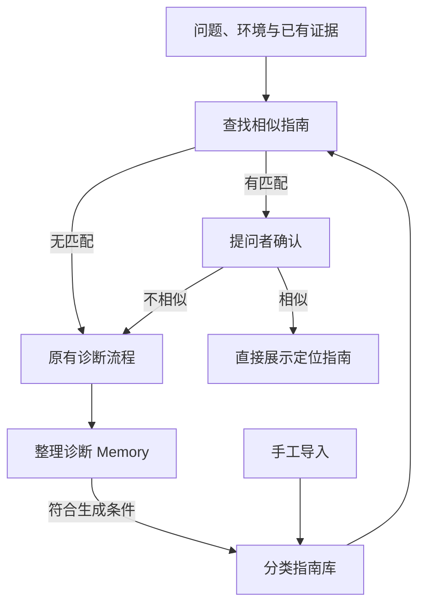

# 问题定位指南

指南把现象明确的诊断经验整理成可复用的排查方法。它可以从 Memory 自动生成，也可以由管理员手工导入。问题入口先查找相似指南，提问者确认相似后直接阅读；没有匹配或明确选择不相似时，才通过原有 ApplicationService 和 Runtime 创建诊断。



## 自动生成

`guides.py` 从 Memory 生成指南，不额外调用模型。案例必须同时满足：问题分类已知、问题摘要非空、有明确症状、诊断 outcome 为 confirmed、存在 evidence_supported 且有历史证据引用的主结论，并包含非空验证步骤。证据不足或只含待验证假设的案例仍留在 Memory，不生成入口指南。

指南继承类别、现象、症状、适用环境/服务/组件/版本/runtime 和来源引用，保留定位步骤、历史结论、未验证原因及信息限制。步骤只是供人参考的数据，系统不会自动执行。历史结论只在来源诊断中成立，不能确认本次根因。

来源 Memory 决定稳定 guide ID。终态、Memory 和新指南在同一 SQLite 事务提交；重放不会重复创建，也不会覆盖之后的人工编辑或停用。Schema v5 升级时从已有有效 Memory 一次性生成符合条件的指南，损坏记录跳过；原 Run revision 和事件保持原值。

## 入口检索

`ApplicationService.find_guides()` 委托 GuideApplicationService 做确定性检索。查找只读取业务指南表，不创建 Run、Command、Event 或 SDK Session，不需要模型凭据。Graph 不访问指南库。

- 同租户检索；可信 Identity 存在时覆盖请求内的 tenant 标签。现有 local/HTTP 标签不构成新增的多租户认证机制。
- 自动指南严格匹配环境和服务，缺少值为独立范围。手工指南可主动省略环境/服务，作为当前租户内的通用指南；指定值时仍需相等。
- 请求与指南都提供组件、版本或 runtime 时，已知的不一致候选被排除。未提供值不代表适用性已确认，阅读时仍需核对。
- 可按既有 ProblemCategory 筛选。在范围内取最近更新的 200 份已启用指南，用问题/实际表现/已有证据与标题/现象/症状做英文技术词、错误码及中文双字词的 Jaccard 匹配。
- 最低相似度 0.12，按相似度、更新时间和 ID 排序，最多 3 个候选，候选数组最多 96 KiB。相似度只代表词项重合，不代表根因概率。

有候选时只建议确认相似；客户端不能自动进入诊断或代替用户确认。无候选时客户端提交原有 StartDiagnosis。明确拒绝候选后直接提交原问题与证据，不重复搜索。搜索失败时保留草稿并提示重试，不等同于“无匹配”。指南阅读结束不伪造 completed Run。

## 手工维护

Web 工作区的“问题定位指南”提供分类筛选、表单导入、JSON 文本/文件导入、查看、编辑和启用/停用。JSON 可填写预期观察、历史参考结论和限制，样例见 [diagnosis-guides.example.json](../config/diagnosis-guides.example.json)。每份指南必须指定明确类别、现象、症状和定位步骤。

手工文本入库前脱敏并校验；一批最多 50 份，任一份无效则整批不写入。更新使用指南独立的数字 revision，冲突时保留草稿，要求重新载入后再编辑。来源 ID、origin 和创建时间不可从导入/编辑 DTO 更改；自动指南经过人工编辑仍保留原始来源。

管理操作复用现有 Admin Bearer Token，公开入口只提供检索和类别。稳定端点、字段与错误状态统一定义在[前后端契约](../../frontend-backend-contract.md)。当前管理 API 面向既有管理员范围，不新增用户角色或租户权限系统。

## CLI

在 backend 目录执行：

```powershell
uv run buglens --import-guides config/diagnosis-guides.example.json --json
uv run buglens "数据库连接池等待超时" --find-guides --json
uv run buglens "数据库连接池等待超时" --guide GUIDE_ID --json
uv run buglens "数据库连接池等待超时" --diagnose --json
```

`--guide` 必须选择本次匹配列表中的 ID。普通交互终端命中时可选择候选编号，或输入 0 表示不相似。非交互终端命中时返回候选并退出码 2，尚未创建诊断；随后用 `--guide` 或 `--diagnose` 明确选择。`--find-guides` 无论是否命中都只查询并返回 0。没有匹配的普通调用自动进入原诊断。

远程调用在上述命令附加 `--remote http://127.0.0.1:8000`。远程导入访问 Admin API，需要服务已配置时通过 `BUGLENS_ADMIN_TOKEN` 提供管理 Token。CLI 导入文件使用 `{tenant_id?, guides:[...]}` 信封格式；Web 还支持把单份对象或数组转换成这个格式。查找、指南阅读与导入不调用模型；进入诊断仍使用已有凭据、目标确认和恢复规则。

## 验证

`tests/test_guides.py` 覆盖生成条件、分类、范围隔离、手工通用范围、版本差异、脱敏、原子导入、迁移、停用、revision 冲突、HTTP 鉴权和 CLI/客户端分流。`tests/test_memory.py` 验证实际诊断终态生成指南、重放去重、事务回滚和数据库重开。前端 `guide-entry.test.mjs` 验证命中不提交诊断、无匹配提交一次、搜索失败不提交、导入格式转换及只读元数据剥离。所有测试均不调用真实模型。
