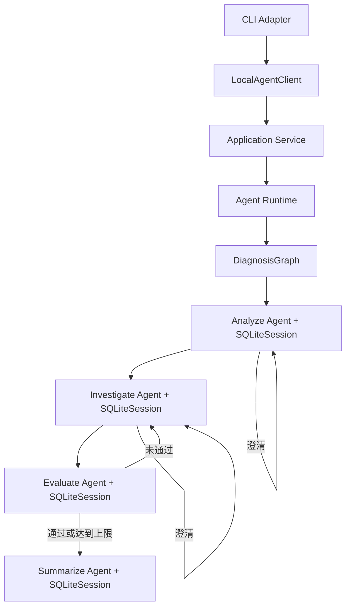
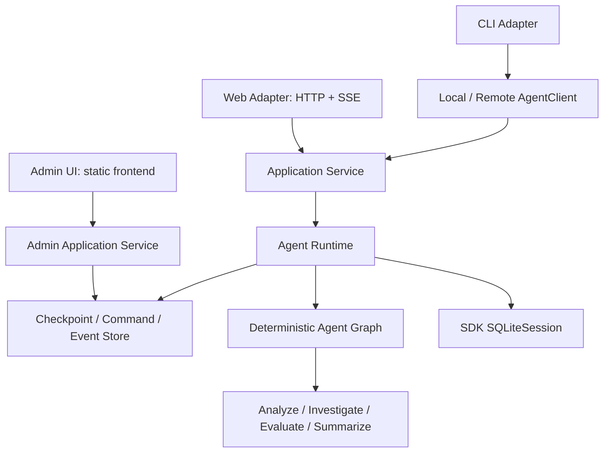

# 当前架构与目标架构

## 当前实现

`DiagnosisGraph` 只负责确定性节点转换，Runtime 保存可恢复业务状态和事件；SDK Session 保存模型消息。同一个节点复用 Session，所以澄清答案和评测反馈可以利用该节点已有上下文；不同节点的 Session ID 不同，因此评测节点不会继承定位节点的完整对话。

HTTP Adapter 现在同时承载两组边界清晰的端点：`/v1/runs/*` 负责诊断数据面，
`/v1/admin/*` 由 `AdminApplicationService` 提供健康、版本、配置和只读运维查询。Admin 服务不调用
Graph，也不复制 Agent 节点逻辑；配置写入由 `ConfigRepository` 负责 revision 检查和原子替换。

| SDK 能力 | 项目用途 |
| --- | --- |
| `Agent` | 定义四个职责独立的节点 |
| `output_type` | 让节点直接返回 Pydantic 结构化对象 |
| `Runner.run()` | 执行模型与 SDK 内部循环 |
| `SQLiteSession` | 持久化每个节点的消息历史 |
| `RunContext` | 携带 run ID、节点和提示词版本等本地元数据 |
| `trace()` | 将一次诊断的多个节点运行归为同一工作流 |
| `max_turns` | 限制单次节点运行的模型循环 |

没有使用 handoff，因为当前流程需要确定性的评测门禁和重试上限。当前实现只处理用户输入证据，尚未使用 function tools 或 MCP；后续接入日志、指标和 Trace 时优先使用 SDK 工具能力。

CLI 退出后，SDK 会话、业务 checkpoint、配置快照和 Event 均保存在 `BUGLENS_SESSION_DB` 指定的 SQLite 文件中。

## 目标架构

CLI 不直接调用 Graph。当前架构为：

Runtime 接受统一 Command、恢复检查点、推进 Graph，并产生统一 Event Stream。CLI 和 Web 只负责 transport 映射和渲染，不直接构造 Graph。等待用户、工具或审批时，Runtime 先持久化再结束短执行。

`frontend/` 是独立的 React + TypeScript 静态工程，仅通过 HTTP Command/SSE Event 和 Admin JSON
契约访问后端。`distribution/` 的 Compose 清单分别启动 backend 和 frontend 制品；backend-only 模式
不需要 Node.js，删除前端目录不会改变 Python CLI/API。

详细目标规范：

- [Runtime 与 Adapter](agent-runtime-adapter-spec.md)
- [Command/Event 协议](agent-protocol-spec.md)
- [生命周期恢复](lifecycle-resume-spec.md)
- [运行配置与快照](runtime-config-spec.md)
- [Admin 控制面](admin-control-plane-spec.md)
