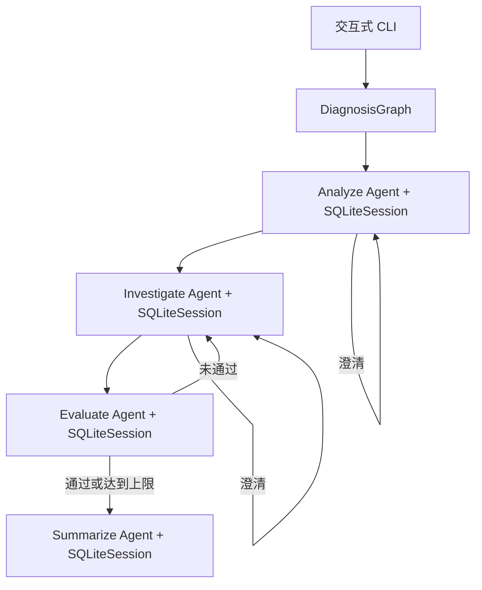
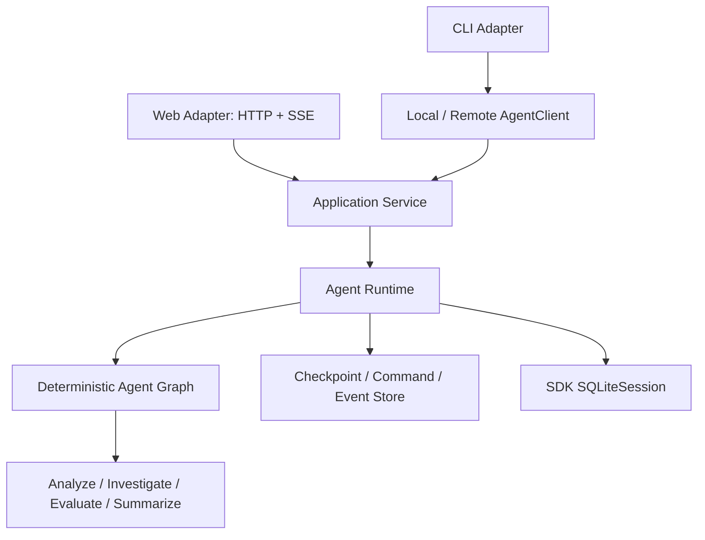

# 当前架构与目标架构

## 当前实现

`DiagnosisGraph` 保存确定性的业务状态，SDK Session 保存模型消息。同一个节点复用 Session，所以澄清答案和评测反馈可以利用该节点已有上下文；不同节点的 Session ID 不同，因此评测节点不会继承定位节点的完整对话。

| SDK 能力 | 项目用途 |
| --- | --- |
| `Agent` | 定义四个职责独立的节点 |
| `output_type` | 让节点直接返回 Pydantic 结构化对象 |
| `Runner.run()` | 执行模型与 SDK 内部循环 |
| `SQLiteSession` | 持久化每个节点的消息历史 |
| `RunContext` | 携带 run ID、节点和提示词版本等本地元数据 |
| `trace()` | 将一次诊断的多个节点运行归为同一工作流 |
| `max_turns` | 限制单次节点运行的模型循环 |

没有使用 handoff，因为当前流程需要确定性的评测门禁和重试上限。当前实现只处理用户输入证据，尚未使用 function tools 或 MCP；后续接入日志、指标和 Trace 时优先使用 SDK 工具能力。

CLI 退出后，SDK 会话保存在 `BUGLENS_SESSION_DB` 指定的 SQLite 文件中。目前业务 Graph 不支持中断恢复；数据库用于 SDK 对话管理和审计基础，不替代未来的业务检查点。

## 目标架构

当前 CLI 直接调用 Graph 是待重构现状，不是长期边界。目标为：

Runtime 接受统一 Command、恢复检查点、推进 Graph，并产生统一 Event Stream。CLI 和 Web 只负责 transport 映射和渲染，不直接构造 Graph。等待用户、工具或审批时，Runtime 先持久化再结束短执行。

详细目标规范：

- [Runtime 与 Adapter](agent-runtime-adapter-spec.md)
- [Command/Event 协议](agent-protocol-spec.md)
- [生命周期恢复](lifecycle-resume-spec.md)
- [运行配置与快照](runtime-config-spec.md)
